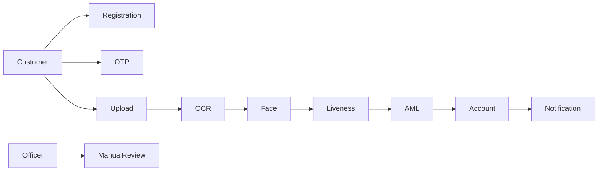
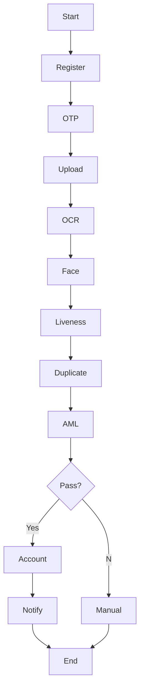
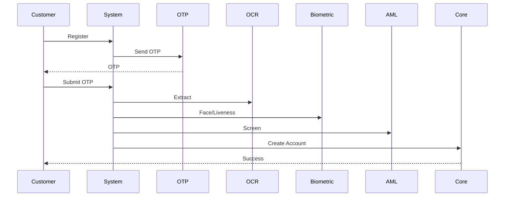
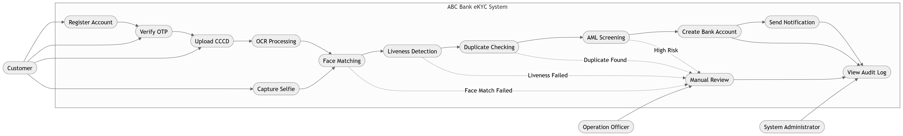

# Software Requirements Specification (SRS)
**Project:** ABC Bank eKYC Online Account Opening  
**Standard:** IEEE 830

## 1. Introduction
### 1.1 Purpose
This document specifies the software requirements for the ABC Bank eKYC Online Account Opening system.

### 1.2 Scope
The system enables customers to open bank accounts remotely through identity verification, biometric validation, AML screening, duplicate checking, and automated account creation.

### 1.3 Definitions, Acronyms, Abbreviations
| Term | Meaning |
|---|---|
| eKYC | Electronic Know Your Customer |
| OCR | Optical Character Recognition |
| AML | Anti-Money Laundering |
| OTP | One-Time Password |
| CCCD | Vietnamese Citizen Identity Card |

### 1.4 References
- IEEE 830 Software Requirements Specification
- ISO 27001
- OWASP ASVS
- Vietnam eKYC regulations

### 1.5 Overview
This document describes functional, non-functional requirements, diagrams, and traceability.

# 2. Overall Description
## Product Perspective
Microservice-based eKYC platform integrated with Core Banking, OCR, Face Matching, AML, SMS/Email Gateway.

## Product Functions
- Registration
- OTP Verification
- CCCD Upload
- OCR
- Face Matching
- Liveness Detection
- Duplicate Checking
- AML Screening
- Account Creation
- Notification
- Audit Log
- Manual Review

## User Classes
- Customer
- Operations Officer
- Compliance Officer
- System Administrator

## Operating Environment
Web, Mobile, REST APIs, Linux, Kubernetes, PostgreSQL.

## Design Constraints
Compliance, encryption, API integration, regulatory retention.

## Assumptions and Dependencies
Stable internet, third-party OCR/AML services available.

# 3. Specific Functional Requirements

## Template (applied to all modules below)
Each module includes:
- Description
- Actors
- Preconditions
- Main Flow
- Alternative Flow
- Postconditions
- Business Rules
- Acceptance Criteria

### FR-01 Registration
- Description: Customer enters personal information.
- Actors: Customer
- Preconditions: Access application.
- Main Flow: Enter data → Validate → Continue.
- Alternative Flow: Invalid input.
- Postconditions: Registration created.
- Business Rules: Mandatory fields required.
- Acceptance Criteria: Valid data proceeds successfully.

### FR-02 OTP Verification
- Description: Verify phone ownership.
- Actors: Customer, OTP Service
- Preconditions: Registration exists.
- Main Flow: Send OTP → Enter OTP → Verify.
- Alternative Flow: OTP expired/resend.
- Postconditions: Phone verified.
- Business Rules: OTP valid 5 minutes, max 5 attempts.
- Acceptance Criteria: Valid OTP accepted.

### FR-03 Upload CCCD
- Description: Upload front/back images.
- Actors: Customer
- Preconditions: OTP verified.
- Main Flow: Upload images.
- Alternative Flow: Unsupported format.
- Postconditions: Images stored.
- Business Rules: JPG/PNG, max 10MB.
- Acceptance Criteria: Images pass validation.

### FR-04 OCR
- Description: Extract identity information.
- Actors: OCR Engine
- Preconditions: Images available.
- Main Flow: OCR → Parse → Validate.
- Alternative Flow: OCR failure.
- Postconditions: Structured data generated.
- Business Rules: Confidence ≥90%.
- Acceptance Criteria: Required fields extracted.

### FR-05 Face Matching
- Description: Compare selfie with ID photo.
- Actors: Biometric Service
- Preconditions: Selfie uploaded.
- Main Flow: Match faces.
- Alternative Flow: Score below threshold.
- Postconditions: Match result available.
- Business Rules: Score ≥85%.
- Acceptance Criteria: Matching succeeds.

### FR-06 Liveness Detection
- Description: Detect spoofing.
- Actors: Biometric Service
- Preconditions: Selfie captured.
- Main Flow: Analyze liveness.
- Alternative Flow: Spoof detected.
- Postconditions: Liveness result.
- Business Rules: Must pass.
- Acceptance Criteria: Genuine user detected.

### FR-07 Duplicate Checking
- Description: Detect existing customer.
- Actors: Core Banking
- Preconditions: Identity available.
- Main Flow: Search → Compare.
- Alternative Flow: Duplicate found.
- Postconditions: Duplicate status.
- Business Rules: National ID unique.
- Acceptance Criteria: No false duplicate.

### FR-08 AML Screening
- Description: Screen sanctions and watchlists.
- Actors: AML Engine
- Preconditions: Customer identified.
- Main Flow: Screen → Score.
- Alternative Flow: Potential hit.
- Postconditions: AML result.
- Business Rules: High-risk routed to review.
- Acceptance Criteria: Screening completed.

### FR-09 Account Creation
- Description: Create customer/account.
- Actors: Core Banking
- Preconditions: All checks passed.
- Main Flow: Create CIF → Account.
- Alternative Flow: Core error.
- Postconditions: Account created.
- Business Rules: Unique account number.
- Acceptance Criteria: Successful creation.

### FR-10 Notification
- Description: Notify customer.
- Actors: Notification Service
- Preconditions: Processing completed.
- Main Flow: Send SMS/Email.
- Alternative Flow: Retry.
- Postconditions: Notification logged.
- Business Rules: Retry 3 times.
- Acceptance Criteria: Delivered.

### FR-11 Audit Log
- Description: Record all activities.
- Actors: System
- Preconditions: User action.
- Main Flow: Persist log.
- Alternative Flow: Queue if unavailable.
- Postconditions: Immutable audit trail.
- Business Rules: Retain 10 years.
- Acceptance Criteria: All events logged.

### FR-12 Manual Review
- Description: Manual verification.
- Actors: Operations Officer
- Preconditions: Flagged case.
- Main Flow: Review → Approve/Reject.
- Alternative Flow: Request more info.
- Postconditions: Final decision.
- Business Rules: Four-eye principle.
- Acceptance Criteria: Decision recorded.

# 4. Non-Functional Requirements
- Security: TLS1.2+, AES-256, RBAC, MFA for admin.
- Performance: 95% requests <2s, end-to-end <60s.
- Availability: 99.9%.
- Scalability: Horizontal scaling to 500 TPS.
- Reliability: Automatic retry and recovery.
- Compliance: KYC/AML regulations, ISO27001.
- Privacy: Consent, masking, retention policy.
- Logging: Centralized immutable logs.
- Monitoring: Metrics, alerting, dashboards.

# 5. Visual Diagram

## Use Case Diagram

## Activity Diagram

## Sequence Diagram

# 6. Traceability Matrix

| Business Requirement | Functional Requirement | User Story | Test Case |
|---|---|---|---|
| Remote onboarding | FR-01 | Register account | TC-01 |
| Verify phone | FR-02 | Verify OTP | TC-02 |
| Capture ID | FR-03 | Upload CCCD | TC-03 |
| Extract data | FR-04 | OCR ID | TC-04 |
| Verify identity | FR-05/06 | Face & Liveness | TC-05 |
| Prevent duplicates | FR-07 | Duplicate check | TC-06 |
| AML compliance | FR-08 | AML screening | TC-07 |
| Open account | FR-09 | Create account | TC-08 |
| Notify customer | FR-10 | Receive notification | TC-09 |
| Audit | FR-11 | Log activity | TC-10 |
| Exception handling | FR-12 | Manual review | TC-11 |

